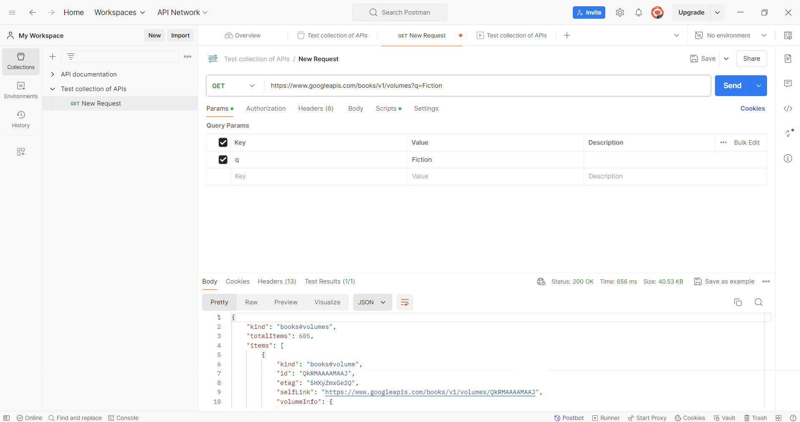
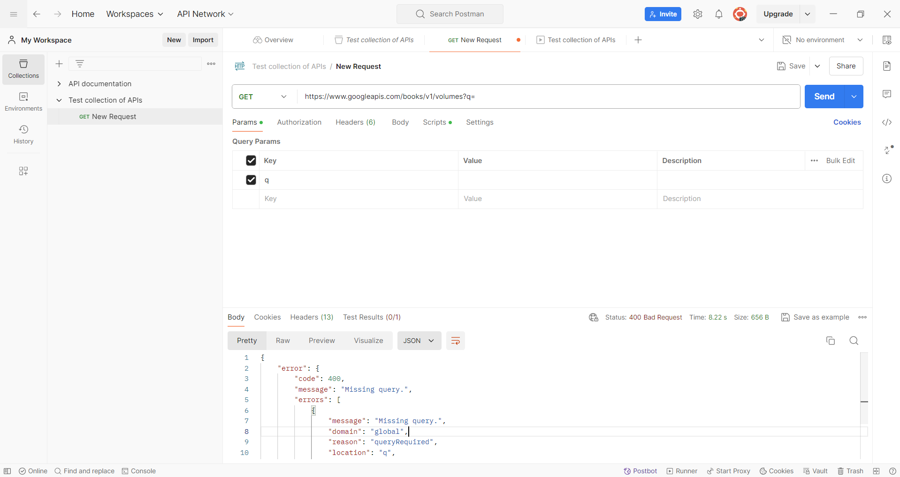
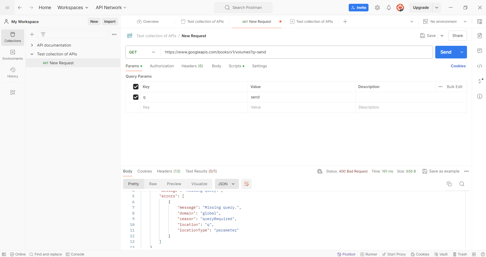

# Sử dụng Postman để kiểm thử một API thực tế.
# Giới thiệu về Postman
1. Postman là gì?
- Postman là một công cụ API platform cho phép phát triển, kiểm thử và quản lý API. Nó cung cấp giao diện đồ họa thân thiện giúp người dùng dễ dàng gửi các yêu cầu HTTP và xem phản hồi từ API.
2. Các tính năng chính của Postman: 
- Gửi các yêu cầu HTTP (GET, POST, PUT, DELETE).
- Lưu trữ và quản lý các bộ sưu tập yêu cầu.
- Sử dụng biến và môi trường để quản lý dữ liệu động.
- Kiểm thử tự động với công cụ Collection Runner.
- Tích hợp các phương thức xác thực khác nhau.
- Kiểm thử hiệu suất và bảo mật API.
# Lựa chọn API để kiểm thử 
- API được lựa chọn là một api về sách của googleapis, api này cung cấp thông tin về các cuốn sách theo từng thể loại như Fiction, Anime, Action & Adventure hay là Horror
# Phân tích API
- Điểm cuối chính: https://www.googleapis.com/books/v1/volumes
- Phương thức: GET
- Tham số bắt buộc: 
    - q: Tên thể loại sách 
        - Ví dụ: q=Fiction
# Các trường hợp kiểm thử: 
- Truy vấn với 1 tên thể loại sách hợp lệ: Kiểm thử API với tên thể loại sách hợp lệ để đảm bảo API trả về dữ liệu đúng
- Truy vấn với tên thể loại sách không hợp lệ: Kiểm thử API với tên thể loại sách không hợp lệ để kiểm tra cách xử lý lỗi của API
- Truy vấn mà không có thể loại sách: Kiểm thử API mà không có thể loại sách để kiểm tra phản hồi của API.
# Thực hiện kiểm thử với Postman
+ Trường hợp 1: Truy vấn với 1 tên thể loại sách hợp lệ
    - Điểm cuối: https://www.googleapis.com/books/v1/volumes?q=Fiction
    - Phương thức: GET
    - Kết quả mong đợi: Mã trạng thái 200 và dữ liệu về các cuốn sách trong thể loại Fiction
    - Kết quả thực tế: 
    - 
+ Trường hợp 2: Truy vấn với tên thể loại sách không hợp lệ
    - Điểm cuối: https://www.googleapis.com/books/v1/volumes?q=send
    - Phương thức: GET
    - Kết quả mong đợi: Mã trạng thái 400 và thông báo "Missing query"
    - Kết quả thực tế: 
    - 
+ Trường hợp 3: Truy vấn mà không có thể loại sách
    - Điểm cuối: https://www.googleapis.com/books/v1/volumes?q=
    - Phương thức: GET
    - Kết quả mong đợi: Mã trạng thái 400 và thông báo "Missing query"
    - Kết quả thực tế: 
    - 